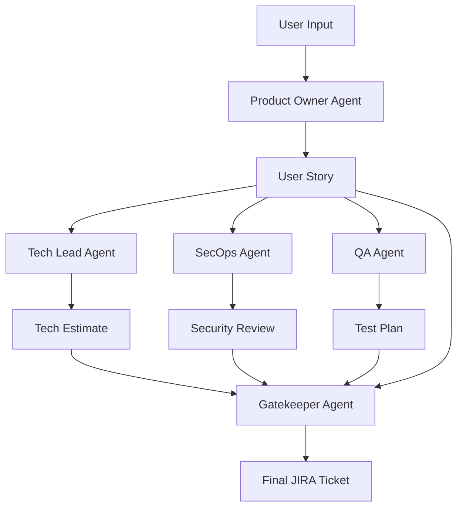

# Agile Sprint Guardian 🛡️

**Turn raw ideas into production-ready JIRA tickets with a team of AI agents.**

![Agile Sprint Guardian Banner]


## 🚀 The Pitch


### The Problem
In software development, the gap between a "brain dump" requirement and a ready-to-work ticket is massive. Product Owners struggle to capture technical details, security implications are often an afterthought, and QA test plans are written too late. This leads to:
- **Ambiguous Requirements**: Developers waste time clarifying what to build.
- **Security Debt**: Vulnerabilities are introduced because security wasn't considered early.
- **Scope Creep**: Poor estimation leads to blown sprints.

### The Solution
**Agile Sprint Guardian** is a multi-agent AI system that acts as your virtual Agile squad. It takes a simple feature request and passes it through a team of specialized AI agents—a Product Owner, Technical Lead, Security Operations (SecOps) expert, and QA Engineer—to produce a comprehensive, refined, and estimated ticket.

### The Value
- **Instant Refinement**: Go from idea to fully groomed ticket in seconds.
- **Shift-Left Security**: Identify OWASP risks *before* a single line of code is written.
- **Better Estimates**: Get technical complexity and story point estimates automatically.
- **Ready-to-Test**: Every ticket comes with a pre-written Gherkin test plan.

---

## 🏗️ Architecture

The system uses a **Sequential-Parallel Hybrid Architecture** powered by **Google Gemini 2.5 Flash**.

### Agent Workflow
1.  **Product Owner Agent (PO)**:
    -   **Input**: Raw "brain dump" from the user.
    -   **Role**: Refines the request into a structured **User Story** with clear Acceptance Criteria.
    -   **Output**: `UserStory` object.

2.  **Specialist Agents (Parallel Execution)**:
    -   The User Story is broadcast to three specialists simultaneously:
    -   **🛠️ Tech Lead Agent**: Analyzes technical complexity, dependencies, and estimates Story Points (Fibonacci).
    -   **🔒 SecOps Agent**: Reviews the story for OWASP Top 10 vulnerabilities and suggests mitigations.
    -   **🧪 QA Agent**: Generates a Test Plan with Gherkin scenarios (Given/When/Then) and identifies edge cases.

3.  **Gatekeeper Agent**:
    -   **Input**: User Story + Tech Estimate + Security Review + Test Plan.
    -   **Role**: Synthesizes all specialist outputs into a final, cohesive **JIRA Ticket**. It ensures the description is well-formatted and all risks are highlighted.
    -   **Output**: `FinalTicket` JSON.

### Technical Stack
-   **AI Model**: Google Gemini 2.5 Flash (via `google-genai` SDK).
-   **Backend**: Python 3.11+, FastAPI.
-   **Data Validation**: Pydantic (for structured agent outputs).
-   **Frontend**: React (served via FastAPI static files).

### Diagram


---

## 🛠️ Setup & Installation

### Prerequisites
-   Python 3.11 or higher
-   A Google Cloud Project with the Gemini API enabled
-   An API Key for Gemini

### Installation Steps

1.  **Clone the Repository**
    ```bash
    git clone https://github.com/yourusername/agile-sprint-guardian.git
    cd agile-sprint-guardian
    ```

2.  **Create a Virtual Environment**
    ```bash
    python -m venv .venv
    # Windows
    .venv\Scripts\activate
    # Mac/Linux
    source .venv/bin/activate
    ```

3.  **Install Dependencies**
    ```bash
    pip install -r requirements.txt
    # OR if using uv/pyproject.toml
    pip install .
    ```

4.  **Configure Environment Variables**
    Create a `.env` file in the root directory:
    ```env
    GOOGLE_API_KEY=your_gemini_api_key_here
    ```

5.  **Run the Application**
    ```bash
    python src/app.py
    ```
    The API will start at `http://localhost:8000`.

---

## 📖 Usage

1.  Open your browser and navigate to `http://localhost:8000` (or the frontend URL).
2.  Enter a raw feature request in the input box.
    -   *Example*: "I want a login page where users can sign in with Google or email/password. It needs to be secure."
3.  Click **Generate Ticket**.
4.  Watch as the agents work:
    -   **PO** creates the story.
    -   **Specialists** analyze it in parallel.
    -   **Gatekeeper** compiles the final result.
5.  View the generated ticket, complete with:
    -   Description & Acceptance Criteria
    -   Story Points & Complexity
    -   Security Risks (e.g., "Ensure OAuth state parameter is used to prevent CSRF")
    -   Test Scenarios

### API Usage
You can also use the API directly:

```bash
curl -X POST http://localhost:8000/api/generate \
  -H "Content-Type: application/json" \
  -d '{"brain_dump": "Add a dark mode toggle to the settings page"}'
```

---

## 🧠 Key Concepts Implemented

1.  **Role-Based Agent Architecture**: Each agent has a distinct persona and system instruction, mimicking a real agile team.
2.  **Parallel Execution**: The framework supports running multiple agents concurrently to reduce latency.
3.  **Structured Outputs**: All agents return strictly typed Pydantic models, ensuring the final output is machine-readable and consistent.
4.  **Observability**: The system saves "traces" of every execution, allowing you to inspect the intermediate outputs of every agent.

---

## 📄 License
MIT License
It was created as a Capstone Project for Kaggle’s 5-Day Agent Intensive Course with Google.
Accordingly, this write-up and project materials are also released under the Attribution 4.0 International (CC BY 4.0) license.

Made with ❤️ by Dhruv Ladani — Supported by Gemini 2.5 Flash
